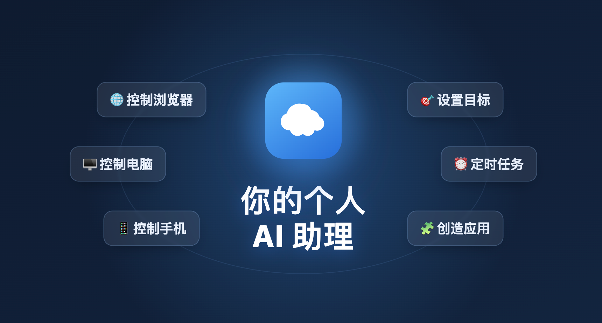

<div align="center">



# one

**掏出手机、或打开网页,给 AI 说一句话 —— 它就在你的电脑上把活干完。**

云端常驻的个人 AI:大脑跑在 Cloudflare,手是你连上来的设备。

</div>

---

## 它能做两件事

|  🖐️ 控制你的设备  |  ⏰ 定时任务 & 目标  |
| :-- | :-- |
| 让 AI 在你的**电脑 / 手机 / 浏览器**上真实操作:跑命令、点按屏幕、开网页、读文件。 | 交给它「每天早八点…」的**日程**,或「持续帮我盯着…」的**目标**,到点自己醒来干活。 |

> 一个大脑,管住你所有的设备和日常。

<div align="center">

🆓 **几乎零成本** —— 全跑在 Cloudflare 免费额度上(Workers + D1 + Durable Objects),不买服务器、不运维<br>
🖥️ 📱 🧩 **全端都有手** —— 桌面 / 安卓 / 浏览器扩展,现成客户端拿来即用<br>
🔒 **数据自持** —— 一人一账户,数据全在你自己的 Cloudflare 账户

</div>

## 跑起来

```bash
# 云端(Cloudflare Worker + D1)
cd worker && npm install && npm --prefix ui install          # 顺带装前端依赖(部署会构建 ui/)
cp wrangler.example.jsonc wrangler.jsonc                      # 填 account_id / database_id
npx wrangler d1 create one                                    # 把拿到的 database_id 填回去
npx wrangler r2 bucket create one                             # 安装包下载桶
npx wrangler d1 execute one --remote --file=schema.sql
npx wrangler secret put AUTH_SECRET                           # 必填:openssl rand -hex 32
npm run deploy
```

打开网页设个访问密码就能用。想让 AI 动手,再连一只「手」——
[🖥 桌面](clients/tauri) · [📱 安卓](clients/android/README.md) · [🧩 浏览器扩展](clients/browser/README.md)(填同一个地址 + 密码即可上线)。

## 架构

```
网页 ─┐
      ├── wss ──▶  worker(Cloudflare 云核:AI 内核 DO + D1 数据 + 实时中继)
桌面 ─┤                       ▲
安卓 ─┘   各端内嵌的「手」── wss ──┘
```

**云端为核心,客户端是壳和手。** 数据全在云端、网页随时访问;桌面 / 安卓 / 浏览器各提供一只手,听云端大脑差遣。

```
worker/      云核(部署到 Cloudflare):ui/ 前端 + server/ 后端(AI 内核 + 数据应用 + 鉴权 + D1)
clients/     各端的「壳 + 手」:tauri/ 桌面 · android/ 安卓 · browser/ 浏览器扩展
```

<details>
<summary><b>数据自己长:AI 建表、AI 记账</b></summary>

<br/>

助理的 `sql` 工具可以查平台数据,也可以自己建表读写 —— 表名以 `data_` 开头即可(平台系统表只能走正式业务接口改)。要它长期记着什么结构化的东西,直接说,它自己开表。

数据库没有迁移脚本:`worker/schema.sql` 即全量真相,升级前用 `npm run db:backup` 导出备份。

</details>

## 更多

安全与信任模型 → [SECURITY.md](SECURITY.md) ·  参与贡献 → [CONTRIBUTING.md](CONTRIBUTING.md)

## License

MIT © 2026 Yanglong Yun
